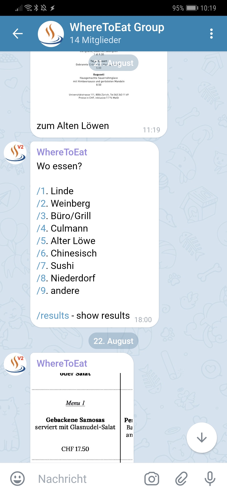
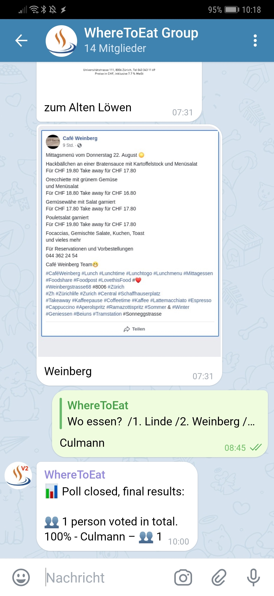
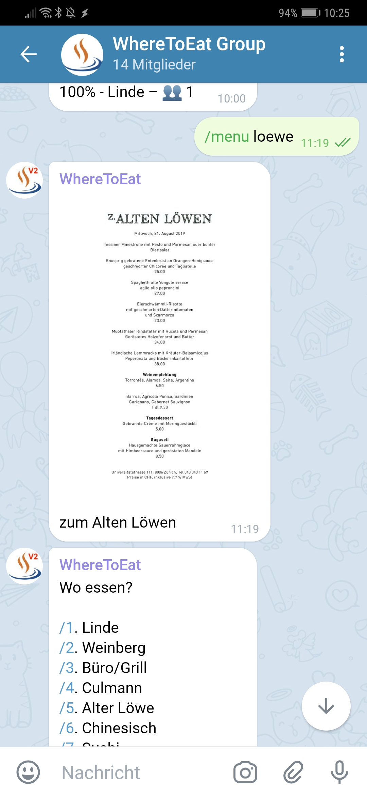

# telegramWhereToEatBot
Telegram Bot sets up a poll so users in a group can vote for a place to eat lunch. Menus of the restaurants can be displayed.

## Screenshots
Active Poll displayed:<br>
<br>
Poll closed:<br>
<br>
Display menu of a restaurant (`/menu loewe`):<br>
<br>

## Usage
```
# src/config.php
<?php
define('BOT_TOKEN', 'XXXXXXXXX:XXXX-XXXXXXXXXXXXXXXX_XXXXXXXXXXXXX');
define('BOT_WEBHOOK', 'https://XXXX/src/poll-bot-webhook.php');
define('CHAT_ID', XXXX);
define('FROM_ID', XXXX);
define('FROM_FIRST_NAME', 'patrick');
define('CHAT_TITLE', 'WhereToEat Group');
```
```
sudo php poll-bot-webhook.php set
sudo php poll-bot-webhook.php remove
```
```
sudo php poll-bot-webhook.php /endpoll
```
```
sudo php poll-bot-webhook.php /newpoll
```

## Automatisation
Use cron to start and end a poll automatically and display the menus of the day on weekdays.
```
# /newpoll every day at 18 o'clock from sunday to thursday
0 18 * * 0-4 /usr/bin/php src/poll-bot-webhook.php "/newpoll"

# /endpoll the next day at 10 o'clock 
0 10 * * 1-5 /usr/bin/php src/poll-bot-webhook.php "/endpoll"

# get the menu every 15 minutes on weekdays between 7 and 10 o'clock. they sometimes run late ;-)
# argument XXXXXXXXXX is the api-key for the online screenshot service http://screeenly.com/
*/15 7-10 * * 1-5 /usr/bin/php src/GetMenuWeinberg.php XXXXXXXXXX

# get the rest of the menus at 7 o'clock on weekdays
# argument XXXXXXXXXX is the api-key for the online screenshot service http://screeenly.com/
0 7 * * 1-5 /usr/bin/php src/GetMenuLinde.php XXXXXXXXXX
0 7 * * 1-5 /usr/bin/php src/GetMenuCulmann.php
0 7 * * 1-5 /usr/bin/php src/GetMenuLoewe.php

# display the menus in the chat at 7:31 o'clock on weekdays
31 7 * * 1-5 /usr/bin/php src/poll-bot-webhook.php "/menu weinberg"
31 7 * * 1-5 /usr/bin/php src/poll-bot-webhook.php "/menu linde"
31 7 * * 1-5 /usr/bin/php src/poll-bot-webhook.php "/menu culmann"
31 7 * * 1-5 /usr/bin/php src/poll-bot-webhook.php "/menu loewe"
```

## Specification
- see https://github.com/kolar/telegram-poll-bot
- Entrypoint: poll-bot-webhook.php
- User is not allowed to send /newpoll, /endpoll
